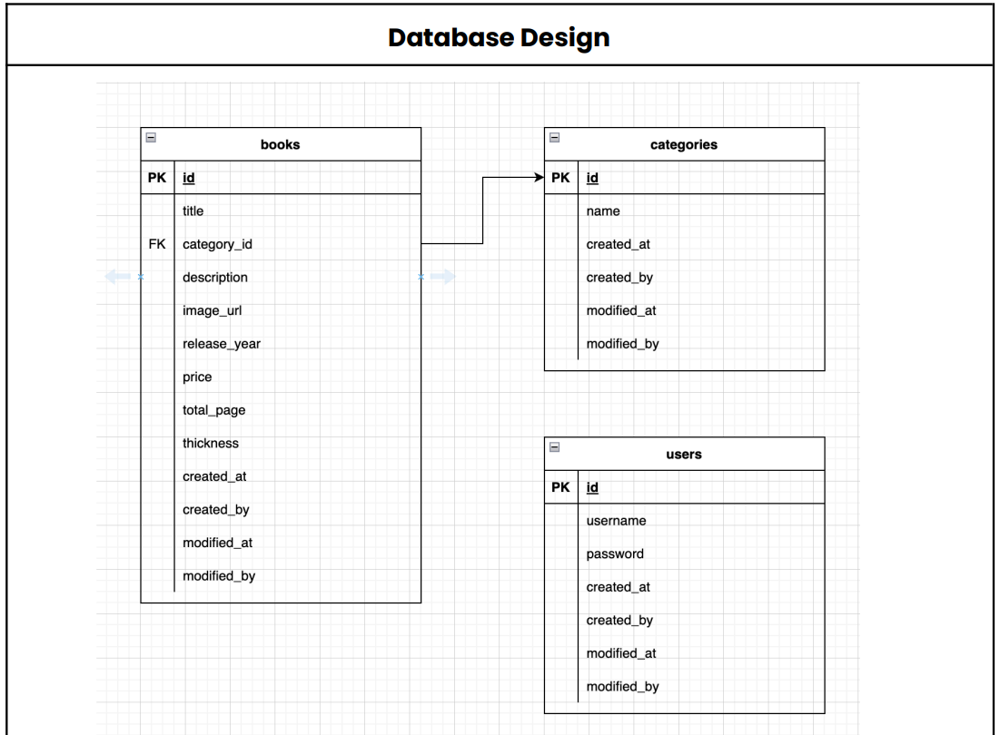

# Mini-project Book Management API

## ERD

sistem ini memiliki 3 tabel :
<ul>
<li>Tabel books</li>
<li>Tabel categories</li>
<li>Tabel users</li>
</ul>

## Teknologi yang Digunakan

- **Go**: Bahasa pemrograman untuk logika backend.
- **Gin Gonic**: Web framework untuk membangun API.
- **Postgresql**: Basis data untuk menyimpan data buku dan kategori.

## menjalankan aplikasi

<ol>
<li>git clone https://github.com/sidoelz123/book_golang </li>
<li>cd book_golang</li>
<li>edit .env</li>
<li>go mod tidy</li>
<li>go run main.go</li>
</ol>

## menjalankan aplikasi dengan docker

<ol>
<li>git clone https://github.com/sidoelz123/book_golang </li>
<li>cd book_golang</li>
<li>edit .env</li>
<li>docker compose up -d --build</li>
</ol>

## Endpoint Login

Endpoint Login digunakan untuk autentikasi pengguna dan mendapatkan token JWT.

Method | Path | Keterangan | Auth | Body Request  
------------- | ------------- | ------------- | -------------  | -------------  
***POST*** | *`{base_url}/login`* | Mengautentikasi pengguna dan mengembalikan token JWT jika kredensial valid. | No  | `{ "username": "string" , "password": "string" }`  

> ⚠️ **Warning**: Anda dapat mengunakan Username dan password yang valid yaitu  **admin** dan **password**

## Fitur and API Endpoints

### Buku

Method | Path | Keterangan | Auth | Body Request  
------------- | ------------- | ------------- | ------------- | -------------  
***GET*** | *`{base_url}/book`* | Mendapatkan daftar semua buku | Yes | -  
***POST*** | *`{base_url}/book`* | Menambahkan buku baru | Yes | `{ "title": "string", "description": "string", "image_url": "string", "release_year": "int, "price": 280000, "total_page": 90, "category_id": 3 }`  
***GET*** | *`{base_url}/book/:id`* | Mendapatkan detail buku berdasarkan ID | Yes | -  
***PUT*** | *`{base_url}/book/:id`* | Memperbarui buku berdasarkan ID | Yes | `{ "title": "string", "description": "string", "image_url": "string", "release_year": "int, "price": 280000, "total_page": 90, "category_id": 3 }`  
***DELETE*** | *`{base_url}/book/:id`* | Menghapus buku berdasarkan ID | Yes | -  
  
### Kategori

Method | Path | Keterangan | Auth | Body Request  
------------- | ------------- | ------------- | ------------- | -------------  
***POST*** | *`{base_url}/category`* | Menambahkan kategori baru | Yes | `{ "id": 7, "name": "string", "created_by": "string", "modified_by": "string" }`  
***GET*** | *`{base_url}/category`* | Mendapatkan daftar semua kategori | Yes | -  
***GET*** | *`{base_url}/category/:id`* | Mendapatkan detail kategori berdasarkan ID | Yes | -  
***PUT*** | *`{base_url}/category/:id`* | Memperbarui detail kategori berdasarkan ID | Yes | `{ "name": "string", "created_by": "string", "modified_by": "string" }`  
***DELETE*** | *`{base_url}/category/:id`* | Menghapus kategori dari sistem berdasarkan ID | Yes | -  
